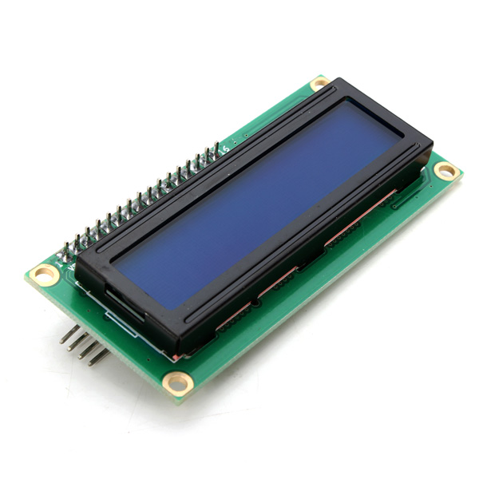
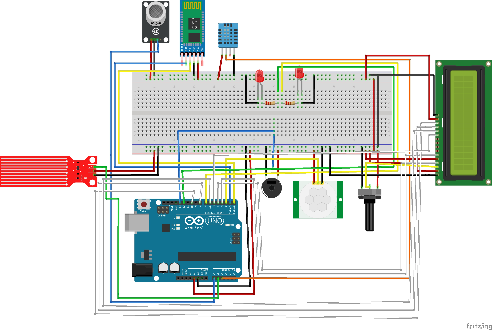
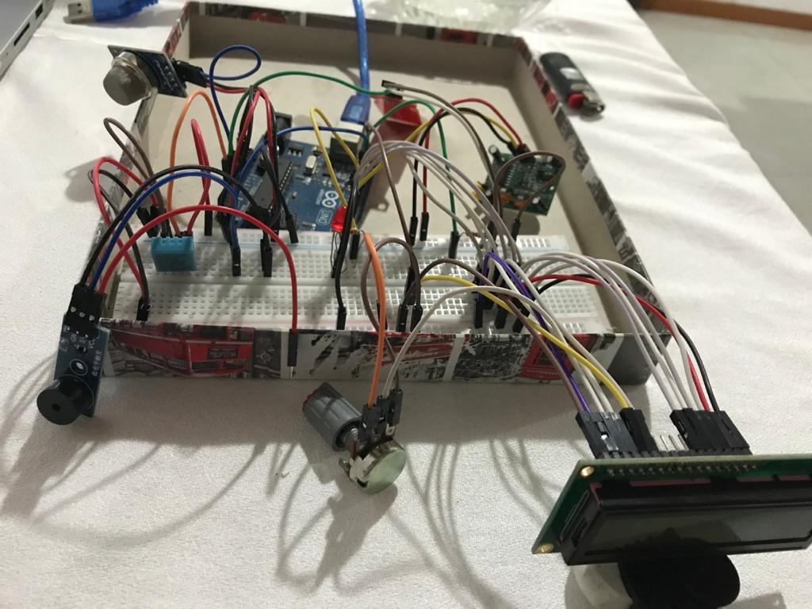
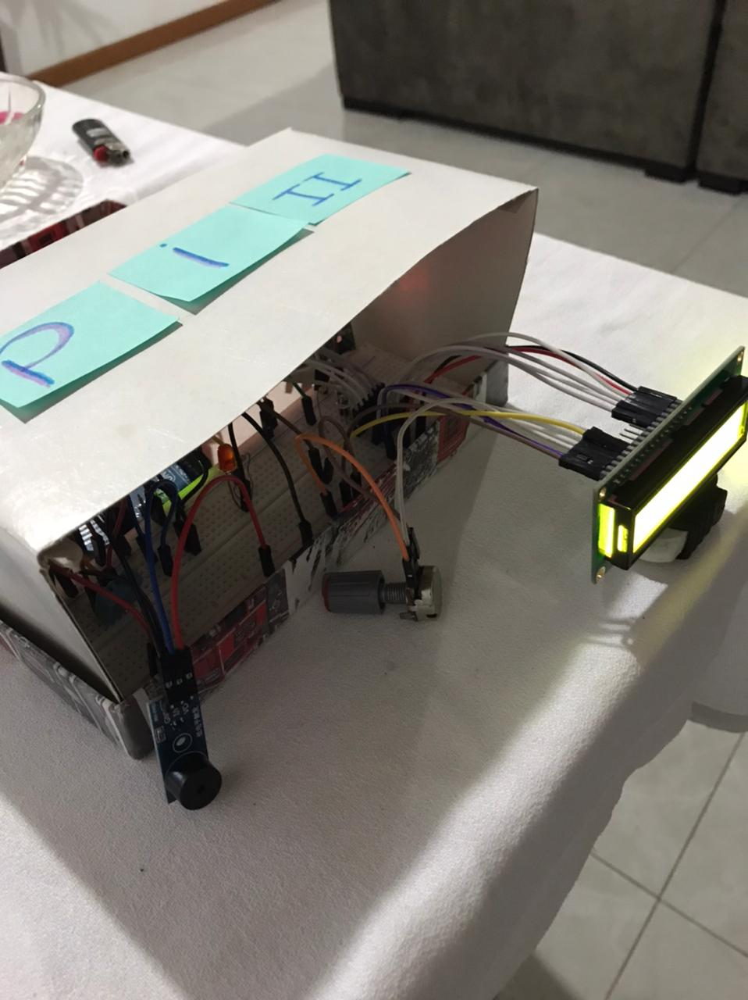

 

<h3 align="center">Domótica</h3>
<h3 align="center">Instituto Federal de Educação, Ciência e Tecnologia de Santa Catarina</h3>
<h3 align="center">Campus Florianópolis</h3>
<h3 align="center">Departamento Acadêmico de Eletrônica</h3>
<h3 align="center">Projeto Integrador II</h3>
<h3 align="center">Giovanna Liz Souza</h3>

Concepção:  Tendo em vista este momento atípico no qual estamos vivendo, a quarentena, famílias inteiras estão dentro de casa a maior parte do tempo, mãe, pai, crianças e avós. Avaliando a necessidade de maior segurança em relação a perda de gás, um sensor de gás inflamável é colocado em pontos estratégicos para captar com maior facilidade o vazamento de gás natural, metano, propano, butano, GLP e/ou hidrogênio. A partir disso o microcontrolador que estiver ligado ao módulo será notificado e poderá tomar uma ação que o usuário determinar. Além da segurança, as pessoas hoje em dia procuram e investem em conforto e praticidade para a sua casa, coisas que poderiam ser feitas sozinhas sem quaisquer esforços, como por exemplo o sensor de presença, que ao detectar movimento de objetos que exalam calor e que estejam dentro do seu raio de detecção fará com que a saída do mesmo seja ativada. São coisas simples que fazem toda a diferença no nosso dia a dia.

Palavras-chave: Automação Residencial. Tecnologia. Domótica.

<h3>Introdução</h3>
Domótica é uma tecnologia recente, responsável pela gestão de todos os recursos habitacionais. Derivada do termo em francês Domotique, é uma fusão da palavra “Domus”, que significa casa, com a palavra “Robótica”, e está ligada ao ato de automatizar, isto é, realizar ações de forma automática. O termo surgiu na França em meados do século passado, a domótica, para além de introduzir conforto e melhoria de vida aos seus utilizadores, introduz ainda novos conceitos, tais como a comunicação e segurança. Surgiu a partir da necessidade do homem de querer realizar o mínimo de esforço durante atividades corriqueiras. O início da implantação e utilização da domótica se deu nos anos 80, durante a construção dos primeiros edifícios, e da necessidade de controlar e interligar as funções de climatização, segurança e iluminação. Depois de alguns anos, a domótica se difundiu e atualmente pode ser aplicada nos lares. Ela permite ao usuário que opere todas as funções da casa através de um software. 

 

Fomos do homem que a princípio habitava uma caverna sem qualquer conforto para o homem que hoje habita em um centro de tecnologia que realiza diversas atividades para ele, sem que o mesmo se esforce. Sem falar que o mercado para esse tipo de tecnologia vem aumentando consideravelmente, apesar de ser inacessível ainda à grande parte da sociedade. 
Para aplicar e implantar este sistema se faz necessário a elaboração de um projeto de automação, o qual identifica todos os pontos eletrônicos do espaço, como por exemplo, som, internet, telefone, televisão, luzes, cortinas, portas e janelas. Outra nomenclatura utilizada para domótica é a Casa Inteligente, o que sugere uma habitação totalmente adaptada ao sistema e programada para auxiliar os moradores nas funções diárias.
É esperado que nos próximos anos isso seja cada vez mais comum, as casas vão se tornar cada vez mais automatizadas, a sociedade vai optar pela praticidade, modernidade, conforto, segurança, além de ser uma forma mais sustentável e também econômica a longo prazo, por ter um maior controle dos recursos na palma de sua mão.

<h3>Tecnologias Usadas</h3>
<h4> Arduino Uno </h4>

O Arduino Uno é uma placa de microcontrolador de código aberto baseada no microcontrolador Microchip ATmega328P e desenvolvida pela Arduino.cc. A placa está equipada com conjuntos de pinos de entrada / saída digitais e analógicos que podem ser conectados a várias placas de expansão e outros circuitos. As entradas e saídas digitais estão localizadas desde o pino 0 até o pino 13. Estes pinos devem ser configurados previamente para que atuem como entradas ou saídas.

 

<h4>Sensor de Gás MQ- 2</h4>
Tem a função de verificar a presença de gás inflamável e/ou fumaça no local onde estiver instalado, alertando o sistema microcontrolador do ocorrido. é capaz de detectar diversos tipos de gases, entre eles: gás de petróleo liquefeito, butano, propano, metano, hidrogênio, álcool, gás natural, entre outros, ou mesmo fumaça.

 

<h4>Módulo Buzzer 5V Passivo</h4>
As formas de onda dos sons são enviadas diretamente para o pino de I/O, resultando em um som mais limpo.

 

<h4>Sensor De Movimento e Presença PIR - HC-SR501</h4>
É capaz de detectar movimento de objetos que exalam calor e que estejam dentro do seu raio de detecção que alcança até 7 metros. Com o sensor atuando, qualquer objeto que se movimentar dentro do seu campo de detecção, fará com que a saída do mesmo seja ativada.

 

<h4>Sensor de água</h4>
Utilizado para detectar o nível ou profundidade de um recipiente com água. Caso não seja detectado água na superfície da placa, a saída analógica do sensor se mantém zerada e quando o sensor detectar a presença de água sobre a superfície, a saída analógica irá variar sua leitura sempre acima de zero.

 

<h4>Display LCD 16x2</h4>
É um display que possui 16 colunas e 2 linhas para escrita, e este modelo tem como principal característica seu fundo azul e sua escrita branca. O Display LCD 16x2 é um modelo de display vastamente utilizado em projetos onde se necessita uma interface homem-máquina.

 

<h3>Design</h3>

 

Design feito com o Fritzing para mostrar a protoboard com as suas devidas ligações</ p>

<h3>Programação - Código</h3>

#include <LiquidCrystal.h>
#include <dht.h>
#include "dht.h" //INCLUSÃO DE BIBLIOTECA

//SENSOR GÁS
int Pinbuzzer = 13; //PINO UTILIZADO PELO BUZZER
int PinA0 = A0;//PINO UTILIZADO PELO SENSOR DE GÁS 
int leitura_sensor = 300;//DEFININDO UM VALOR LIMITE 

//SENSOR PIR
const int pinoPIR = 2; //PINO DIGITAL UTILIZADO PELO SENSOR DE PRESENÇA
const int pinoLED = 7; //PINO DIGITAL UTILIZADO PELO LED

//SENSOR AGUA
const int pinoSensor = A1; //PINO ANALÓGICO UTILIZADO PELO SENSOR
const int pinoLEDD = 12; //PINO DIGITAL UTILIZADO PELO LED

//SENSOR DHT11
dht DHT; //VARIÁVEL DO TIPO DHT
const int pinoDHT11 = A2; //PINO ANALÓGICO UTILIZADO PELO DHT11
const int rs = 11, rw = 0 , e = 10, d4 = 5, d5 = 4, d6 = 3, d7 = 8; // PINOS UTILIZADOS PELO LCD
LiquidCrystal lcd(rs, rw, e, d4, d5, d6, d7);

//SIMBOLO DE GRAU
byte grau[8] ={ B00001100,
                B00010010,
                B00010010,
                B00001100,
                B00000000,
                B00000000,
                B00000000,
                B00000000,};

void setup(){

//SENSOR GAS
pinMode(PinA0, INPUT); //DEFINE O PINO COMO ENTRADA
pinMode(Pinbuzzer, OUTPUT); //DEFINE O PINO COMO SAÍDA
Serial.begin(9600);//INICIALIZA A SERIAL

//SENSOR PIR
pinMode(pinoLED, OUTPUT); //DEFINE O PINO COMO SAÍDA
pinMode(pinoPIR, INPUT); //DEFINE O PINO COMO ENTRADA

//SENSOR AGUA
pinMode(pinoSensor, INPUT); //DEFINE O PINO COMO ENTRADA
pinMode(pinoLEDD, OUTPUT); //DEFINE O PINO COMO SAÍDA

//SENSOR DHT11
Serial.begin(9600); //Inicializa a serial
lcd.begin(16,2); //Inicializa LCD
//CRIA O CARACTERE PARA O SIMBOLO DO GRAU
lcd.createChar(0, grau);
  
}
void loop(){

//SENSOR GAS
int valor_analogico = analogRead(PinA0); //VARIÁVEL RECEBE O VALOR LIDO NO PINO ANALÓGICO
Serial.print("Leitura: "); //EXIBE O TEXTO NO MONITOR SERIAL
Serial.println(valor_analogico);// MOSTRA NO MONITOR SERIAL O VALOR LIDO DO PINO ANALÓGICO
 if (valor_analogico > leitura_sensor){//SE VALOR LIDO NO PINO ANALÓGICO FOR MAIOR QUE O VALOR LIMITE, FAZ 
 digitalWrite(Pinbuzzer, HIGH); //ATIVA O BUZZER E O MESMO EMITE O SINAL SONORO
 }else{ //SENÃO, FAZ
 digitalWrite(Pinbuzzer, LOW);//BUZZER DESLIGADO
 }
 delay(100); //INTERVALO DE 100 MILISSEGUNDOS

//SENSOR PIR
 if(digitalRead(pinoPIR) == HIGH){ //SE A LEITURA DO PINO FOR IGUAL A HIGH, FAZ
    digitalWrite(pinoLED, HIGH); //ACENDE O LED
 }else{ //SENÃO, FAZ
  digitalWrite(pinoLED, LOW); //APAGA O LED
 }

//SENSOR AGUA
if(analogRead(pinoSensor) > 690){ //SE A LEITURA DO PINO FOR MAIOR QUE 690 BITS, FAZ
      digitalWrite(pinoLEDD, HIGH); //ACENDE O LED
  }else{ //SENÃO, FAZ
    digitalWrite(pinoLEDD, LOW); //APAGA O LED
  }

//SENSOR DHT11   
DHT.read11(pinoDHT11); //LÊ AS INFORMAÇÕES DO SENSOR
  Serial.print("Umidade: "); //IMPRIME O TEXTO NA SERIAL
  Serial.print(DHT.humidity); //IMPRIME NA SERIAL O VALOR DE UMIDADE MEDIDO
  Serial.print("%"); //ESCREVE O TEXTO EM SEGUIDA
  Serial.print(" / Temperatura: "); //IMPRIME O TEXTO NA SERIAL
  Serial.print(DHT.temperature, 0); //IMPRIME NA SERIAL O VALOR DE UMIDADE MEDIDO E REMOVE A PARTE DECIMAL
  Serial.println("*C"); //IMPRIME O TEXTO NA SERIAL
  delay(2000); //INTERVALO DE 2 SEGUNDOS

 //LCD
float h = DHT.humidity;     //Le o valor da umidade
float t = DHT.temperature;  //Le o valor da temperatura

  //FUNÇAO TEMPERATURA NO LCD
  lcd.setCursor(0,0);
  lcd.print("Temp: ");
  lcd.setCursor(5,0);
  lcd.print(t,1);
  lcd.setCursor(9,0);
  lcd.write((byte)0); //Mostra o simbolo do grau formado pelo array
  
  //FUNÇAO UMIDADE NO LCD
  lcd.setCursor(0,1);
  lcd.print("Umid: ");
  lcd.setCursor(5,1);
  lcd.print(h,1);
  lcd.setCursor(9,1);
  lcd.print("%");
 delay(2000);
}

<h3>Operação</h3>
Na primeira imagem é o projeto em andamento e na segunda é o projeto finalizado.

 

 

Link do vídeo: https://1drv.ms/v/s!Anyw5wPwOlPSrVE3sANCs8WmEyId

<h3>Considerações Finais</h3>
Com o projeto finalizado pode-se notar que a ideia inicial do projeto era em alguns pontos bem diferente do que foi apresentado no final. Inicialmente foi planejado usar o módulo bluetooth junto com o arduino e o aplicativo BLYNK para fazer a comunicação externa, porém o hc-05 está limitado apenas para android, o que impossibilitou a continuidade do que havia sido planejado. Com isso, usei como alternativa o Display LCD, que me daria uma comunicação externa melhor. Outra alternativa seria um módulo WI-FI, porém como estamos em tempos difíceis, de quarentena e EaD, não consegui adquirir o mesmo. 
Para melhorias futuras, teria em vista a troca do Display por um módulo wifi, usando tecnologias mais avançadas para que possa abranger não apenas Android mas também IOS. E para finalizar, um design de produto mais otimizado. 

<h3>Referências</h3>
<https://www.infoescola.com/tecnologia/domotica/> Acesso em: 12 de novembro 2020
<https://www.mundodaeletrica.com.br/domotica-o-que-e-quais-as-vantagens/> Acesso em: 12 de novembro 2020
<https://mundoeducacao.uol.com.br/informatica/domotica.htm> Acesso em: 12 de novembro 2020
<https://blog.getninjas.com.br/o-que-e-domotica/> Acesso em: 12 de novembro 2020
<http://www.sislite.pt/domus.htm#:~:text=Dom%C3%B3tica%20%C3%A9%20uma%20tecnologia%20recente,realizar%20a%C3%A7%C3%B5es%20de%20forma%20autom%C3%A1tica.> Acesso em: 12 de novembro 2020

  

