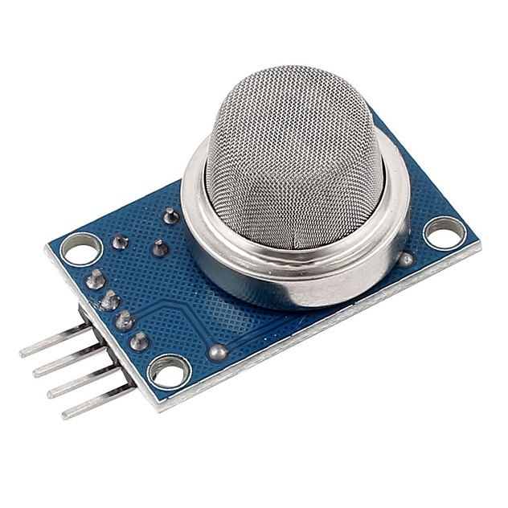
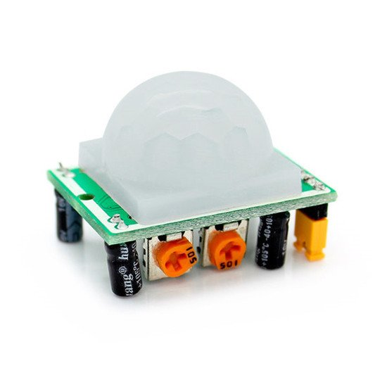
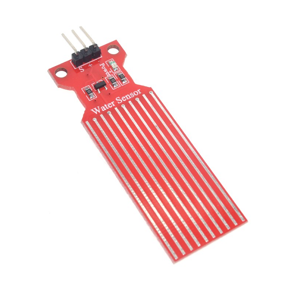
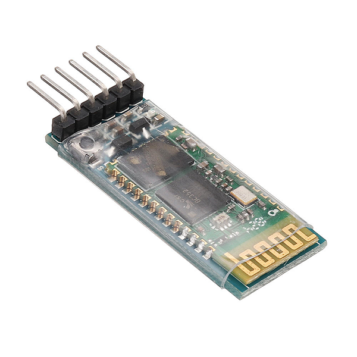

 

<h3 align="center">Domótica</h3>
<h3 align="center">Instituto Federal de Educação, Ciência e Tecnologia de Santa Catarina</h3>
<h3 align="center">Campus Florianópolis</h3>
<h3 align="center">Departamento Acadêmico de Eletrônica</h3>
<h3 align="center">Projeto Integrador II</h3>
<h3 align="center">Giovanna Liz Souza</h3>

Concepção:  Tendo em vista este momento atípico no qual estamos vivendo, a quarentena, famílias inteiras estão dentro de casa a maior parte do tempo, mãe, pai, crianças e avós. Avaliando a necessidade de maior segurança em relação a perda de gás, um sensor de gás inflamável é colocado em pontos estratégicos para captar com maior facilidade o vazamento de gás natural, metano, propano, butano, GLP e/ou hidrogênio. A partir disso o microcontrolador que estiver ligado ao módulo será notificado e poderá tomar uma ação que o usuário determinar. Além da segurança, as pessoas hoje em dia procuram e investem em conforto e praticidade para a sua casa, coisas que poderiam ser feitas sozinhas sem quaisquer esforços, como por exemplo o sensor de presença, que ao detectar movimento de objetos que exalam calor e que estejam dentro do seu raio de detecção fará com que a saída do mesmo seja ativada. São coisas simples que fazem toda a diferença no nosso dia a dia.

Palavras-chave: Automação Residencial. Tecnologia. Domótica.

<h3>Introdução</h3>
Domótica é uma tecnologia recente, responsável pela gestão de todos os recursos habitacionais. Derivada do termo em francês Domotique, é uma fusão da palavra “Domus”, que significa casa, com a palavra “Robótica”, e está ligada ao ato de automatizar, isto é, realizar ações de forma automática. O termo surgiu na França em meados do século passado, a domótica, para além de introduzir conforto e melhoria de vida aos seus utilizadores, introduz ainda novos conceitos, tais como a comunicação e segurança. Surgiu a partir da necessidade do homem de querer realizar o mínimo de esforço durante atividades corriqueiras. O início da implantação e utilização da domótica se deu nos anos 80, durante a construção dos primeiros edifícios, e da necessidade de controlar e interligar as funções de climatização, segurança e iluminação. Depois de alguns anos, a domótica se difundiu e atualmente pode ser aplicada nos lares. Ela permite ao usuário que opere todas as funções da casa através de um software. 

 

Fomos do homem que a princípio habitava uma caverna sem qualquer conforto para o homem que hoje habita em um centro de tecnologia que realiza diversas atividades para ele, sem que o mesmo se esforce. Sem falar que o mercado para esse tipo de tecnologia vem aumentando consideravelmente, apesar de ser inacessível ainda à grande parte da sociedade. 
Para aplicar e implantar este sistema se faz necessário a elaboração de um projeto de automação, o qual identifica todos os pontos eletrônicos do espaço, como por exemplo, som, internet, telefone, televisão, luzes, cortinas, portas e janelas. Outra nomenclatura utilizada para domótica é a Casa Inteligente, o que sugere uma habitação totalmente adaptada ao sistema e programada para auxiliar os moradores nas funções diárias.
É esperado que nos próximos anos isso seja cada vez mais comum, as casas vão se tornar cada vez mais automatizadas, a sociedade vai optar pela praticidade, modernidade, conforto, segurança, além de ser uma forma mais sustentável e também econômica a longo prazo, por ter um maior controle dos recursos na palma de sua mão.

<h3>Tecnologias Usadas</h3>
<h4> Arduino Uno </h4>

O Arduino Uno é uma placa de microcontrolador de código aberto baseada no microcontrolador Microchip ATmega328P e desenvolvida pela Arduino.cc. A placa está equipada com conjuntos de pinos de entrada / saída digitais e analógicos que podem ser conectados a várias placas de expansão e outros circuitos. As entradas e saídas digitais estão localizadas desde o pino 0 até o pino 13. Estes pinos devem ser configurados previamente para que atuem como entradas ou saídas.

 

<h4>Sensor de Gás MQ- 2</h4>
Tem a função de verificar a presença de gás inflamável e/ou fumaça no local onde estiver instalado, alertando o sistema microcontrolador do ocorrido. é capaz de detectar diversos tipos de gases, entre eles: gás de petróleo liquefeito, butano, propano, metano, hidrogênio, álcool, gás natural, entre outros, ou mesmo fumaça.

 

<h4>Módulo Buzzer 5V Passivo</h4>
As formas de onda dos sons são enviadas diretamente para o pino de I/O, resultando em um som mais limpo.

 

<h4>Sensor De Movimento e Presença PIR - HC-SR501</h4>
É capaz de detectar movimento de objetos que exalam calor e que estejam dentro do seu raio de detecção que alcança até 7 metros. Com o sensor atuando, qualquer objeto que se movimentar dentro do seu campo de detecção, fará com que a saída do mesmo seja ativada.

 

<h4>Sensor de água</h4>
Utilizado para detectar o nível ou profundidade de um recipiente com água. Caso não seja detectado água na superfície da placa, a saída analógica do sensor se mantém zerada e quando o sensor detectar a presença de água sobre a superfície, a saída analógica irá variar sua leitura sempre acima de zero.

 

<h4>Módulo Bluetooth HC-05 / HC-06</h4>
Possibilita transmitir e receber dados através de comunicação sem fio. Este módulo pode ser utilizado para criação de comunicação wireless para troca de informações entre dispositivos.

 

<h3>Design</h3>

  

