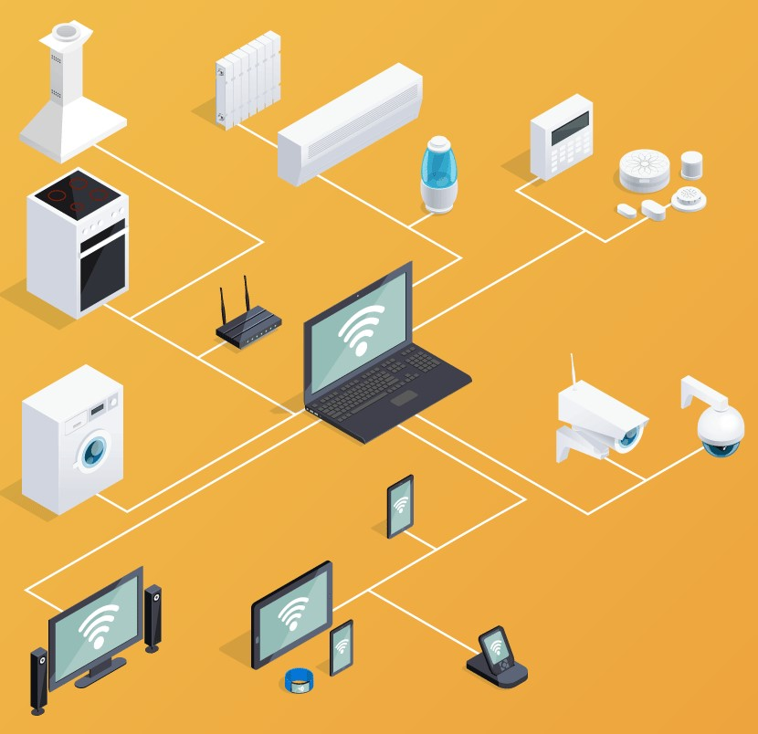

<table align="center"><tr><td align="center" width="9999"> 

# SMART IDEAS

<b>Instituto Federal de Educação, Ciência e Tecnologia de Santa Catarina 
Campus Florianópolis 
Departamento Acadêmico de Eletrônica 
Projeto Integrador II</b>

*Jonathan Chrysostomo Cabral Bonette*
</td></tr></table>

As smart homes, também conhecidas como casas conectadas, viraram tendência nos últimos anos. Esse conceito de moradia envolve o uso da tecnologia para garantir mais conforto, segurança e praticidade aos moradores. Essa categoria de produtos inclui smart displays, fechaduras, câmeras de segurança e até mesmo lâmpadas. Os dispositivos são conectados à Internet e podem ser controlados à distância pelo celular, uma grande facilidade para os usuários. No caso das luminárias, por exemplo, essa característica ajuda até mesmo a economizar energia.

De acordo com informações do site Techaeris, quase 70% dos americanos imaginam que, em cerca de uma década, as smart home serão tão populares quanto smartphones. Além disso, mais de 80% dos compradores de imóveis dizem que casas inteligentes estão entre suas preferências para uma possível aquisição. Confira a seguir mais detalhes a respeito do conceito e conheça alguns dispositivos conectados que já estão disponíveis para comprar no Brasil.

<h2 align="center">Idealização do Projeto</h2>

A principal característica das casas conectadas é o uso massivo de tecnologia de ponta, mesmo em itens comuns como lâmpadas ou fechaduras. O emprego desses dispositivos tem como objetivo trazer maior comodidade, mesmo para tarefas simples como abrir a garagem ou apagar as luzes. A proposta desse projeto é mostrar como que simples ações podem ser automatizadas de formas bem diferentes das usuais.

Ao detectar o sol, sua janela se abre, o breafing diário liga e sua rotina começa, seu café começa a passar, você está pronto para seu dia, devidamente vestido para o dia, pois sua assistente virtual já falou se vai fazer chuva ou sol, se deve levar um guarda-chuva ou um óculos de sol, já sabe quais seus compromissos do dia e as principais notícias de seu interesse até o presente momento, tudo isso sem você fazer absolutamente nada (depois de ter que fazer tudo isso, é claro), e poder comandar e acomoanhar sua casa quando estiver fora dela, será que tem gente por ali? Quantos graus está hoje? Acender ou ligar uma músic ambiente — *ahh o futuro! Ou melhor, o presente!* — .

A idéia desse projeto foi retratar algumas dessas finalidades em um único lugar, o nosso celular. Usando um bot do Telegram, podemos conversar com a casa, mandar comandos para ela, acender a luz do quarto, ver a temperatura, a humidade, ligar uma televisão, uma câmera, etc.

********************************************************
<h2 align="center">Itens Utilizados (Hardware e Componentes)</h2>

**Sensor de Luminosidade LDR 5mm** 
Usado para detectar a luz do sol e acender o LED. 

 

**Módulo Relé 5V 1 Canal** 
Usado para ligar/desligar um determinado sensor/aparelho.

 

**Módulo WiFi ESP8266 NodeMcu ESP-12** 
Necessário para se comunicar com o bot do Telegram e acionar dispositivos.

 

**Sensor de Umidade e Temperatura DHT11** 
Necessário para medir temperatura e humidade do ar.

 

**LEDs 5mm** 
Usados para representarem luzes de ambientes ou lâmpadas.

 

**Arduino R3 Mega** 
Necessário para se comunicar com o o sistema.

 

**Celular** 
Usado para mandar os comandos ao sistema e se comunicar com a Alexa (para os que não possuem a assistente virtual da Amazon, Amazon Echo).

 
 

**Resistores** 
Usados para o funcionamento adequado do circuito.

 

**Transistor** 
Usado para o funcionamento adequado do circuito.

 

**Jumpers** 
Usados para o funcionamento adequado do circuito.

 

********************************************************
<h2 align="center">C: Conceito</h2>

Concepção do projeto 
Fluxograma?
********************************************************
<h2 align="center">D: Design</h2>

Imagens do fritzing 
Imagens reais 
Diagrama de blocos? 
Fluxograma?
********************************************************
<h2 align="center">I: Implementação</h2>

Código arduino 
Código telegram? 
Explicação das etapas 
Aplicativo?
********************************************************
<h2 align="center">O: Operação</h2>

Vídeo explicativo 
Fotos explicativas 
Fotos do aplicativo? 
Bot?
********************************************************
<h2 align="center">Resultados, Percepções Pessoais e Considerações Finais</h2>

Os resultados foram excelentes devido ao tempo e experiência na área pela minha pessoa, fiquei surpreso pela quantidade de possibilidades que podiamos ter e isso de certa forma até me deixou um pouco confuso, pois cada coisa que procurava na internet ficava mais entusiasmado de incluir mais um sensor, fazer uma coisa sempre a mais, dificultando as vezes o andamento do projeto.

Deixar o tema livre para o desenvolvimento do trabalho, me fez procurar bem mais a respeito dos sensores e aplicações, correr atrás e pensar em diversas soluções para o que havia proposto e no final do projeto, muito mais entusiamo pela área.

As dificuldades encontradas por mim foi o uso pela primeira vez do arduino e dos sensores, descobrir como funciona a IDE do arduino, os sensores, suas pinagens, como usar e fazer conversarem entre sí e apesar da faculdade prover todos os equipamentos, alguns equipamentos usados nesse projeto tiveram que ser comprados a parte como o ESP8266 e o módulo Bluetooh (não utilizado nesse peojeto mas essencial para ver como que funiona a conectividade dos sensores com um celular) e elevaram um pouco o processo de aprendizagem assim como a dificuldade encontrada por querer também aplica em um Bot do Telegram que é um recurso totalmente novo para mim.

********************************************************
<h2 align="center">Melhorias</h2>

No primeiro momento existem várias melhorias que poderiam ser implementadas, luzes, sensores e/ou equipamentos que poderiam ser ligados diretamente no relê, e outros sensores diretamente na protoboard. E a longo prazo poderiamos pensar grande, com tempo e conhecimento adequados, podemos explorar por exemplo a instalação de um sistema parecido para automatizar todos os setores de uma residência, portão, verificação de entrada, câmeras, sensores diversos, luzes, automatização de cômodos, entre outras funções.  

 
 

********************************************************
<h2 align="center">Referências Bibliográficas</h2>

https://github.com/Gianbacchio/ESP8266-TelegramBot
https://create.arduino.cc/projecthub/Shubhamkumar97/home-automation-using-arduino-and-bluetooth-control-404e9c?ref=search&ref_id=ldr%20window&offset=6
